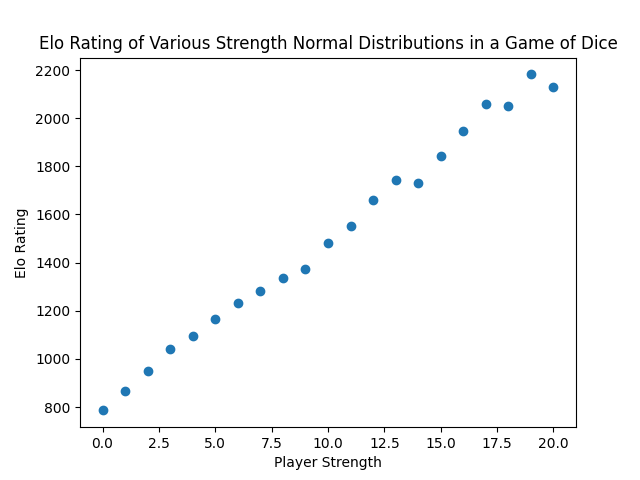
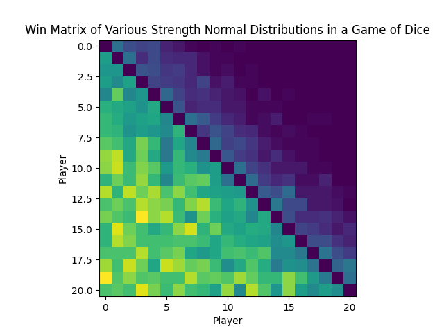

# Elo Rating Simulator

Elo rating provides a relative strength metric for players within a zero-sum game, such as chess or go. This code simulates a game of "Dice" where two players roll a number from a normal distribution, and the player with the higher roll wins. Each player has a "strength" which is just the mean of the distribution. By default, there are 21 players with means spaced evenly from -10 to 10, and a default standard deviation of 3.

Run the simulations with

```buildoutcfg
python elo.py [num_simulations]
```

If no argument is provided, it defaults to running 10,000 simulations. This will print out the elo scores of the players after completing the simulated games, a plot of the wins matrix, and a scatter plot of the elo scores.




The results illustrate the expected results for this simple game: a linear distribution of elo scores among the players, i.e., a linear correlation between the mean of the distribution and the elo score.

### Customize the simulation:
You can edit the range of the playerStrengths array or the width to customize the means and standard deviation respectively.
The initial elo score and the expected average score is 1500, and there's a rate of change of 16. This uses a linear score updating function as is the standard.